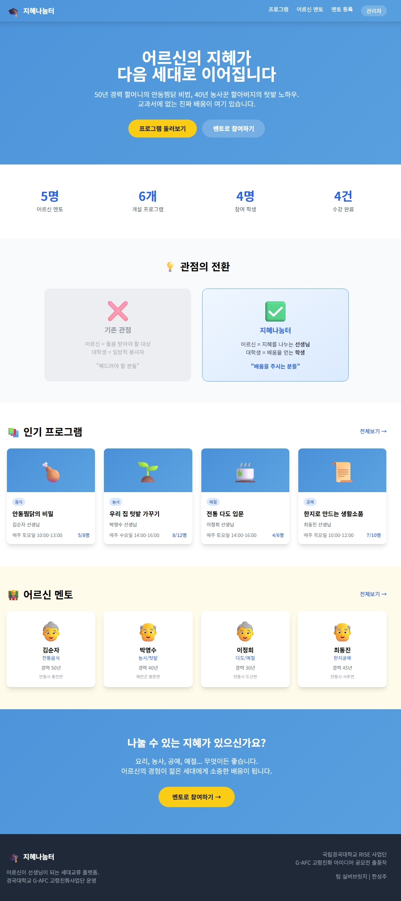
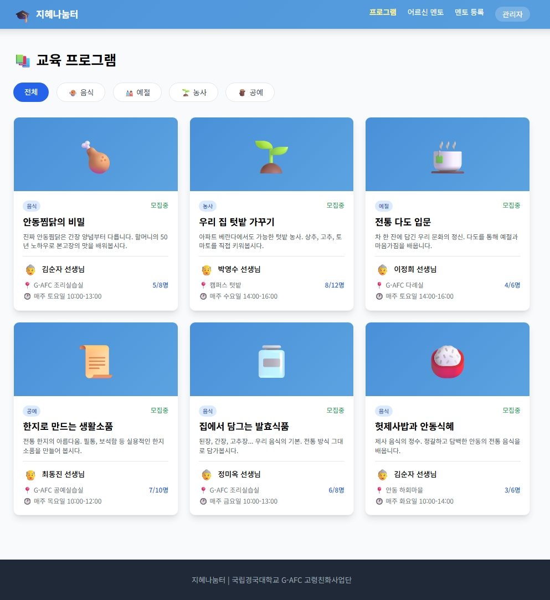
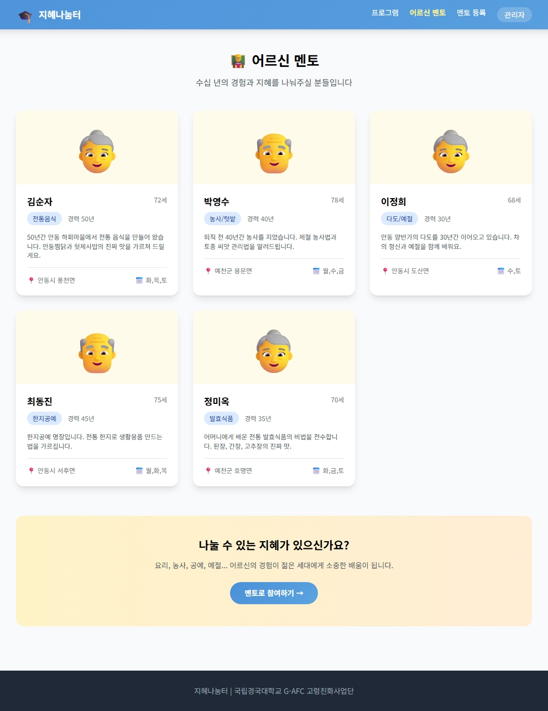
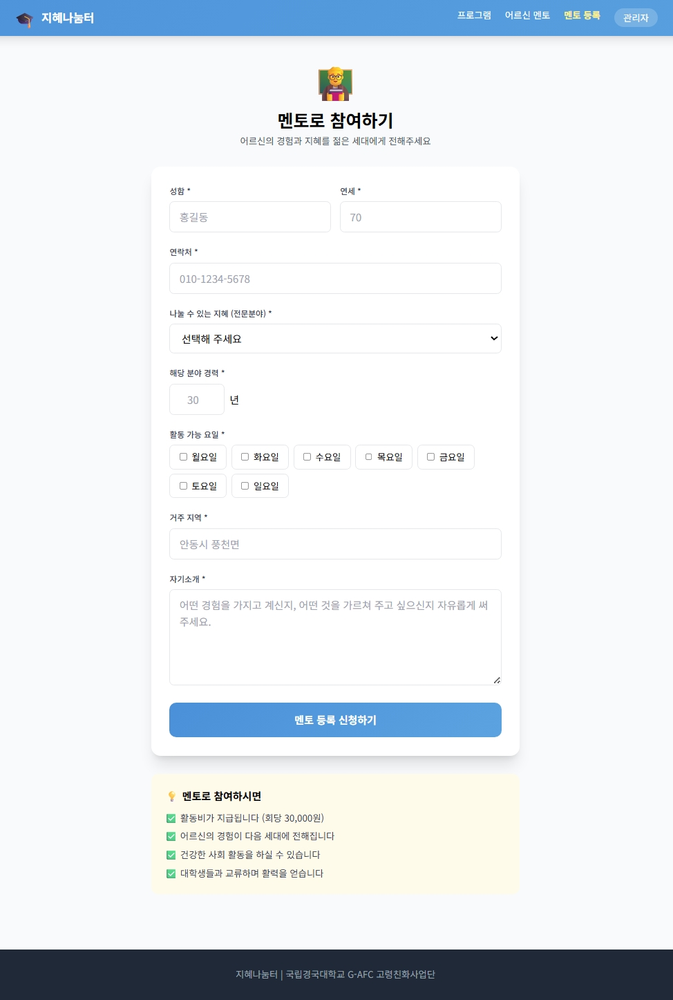
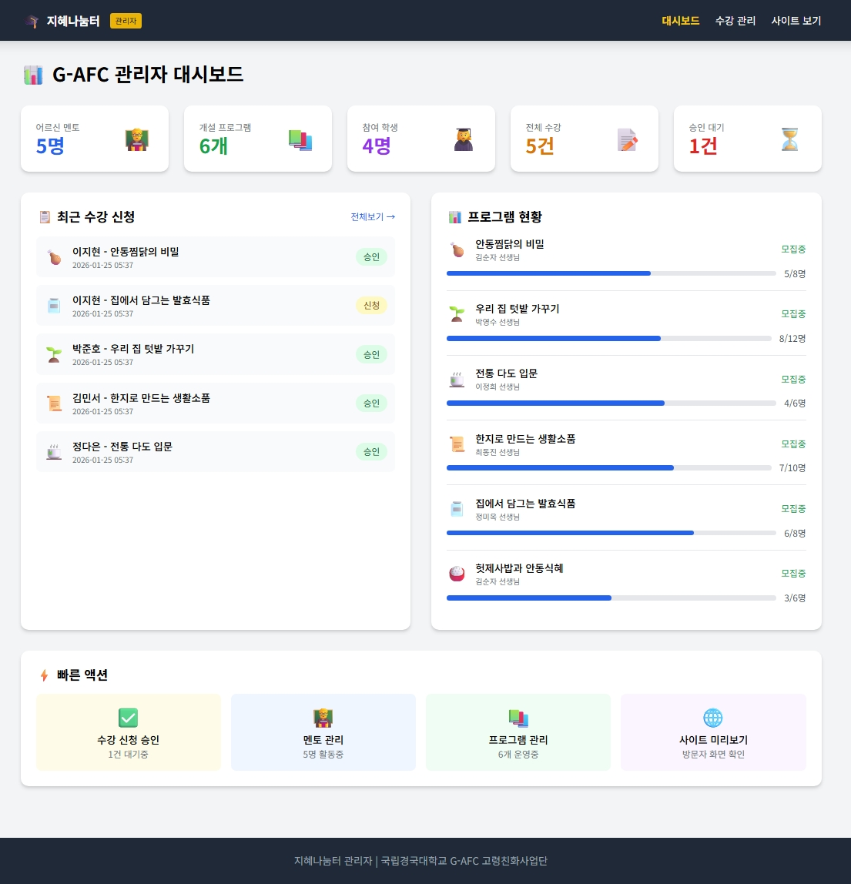
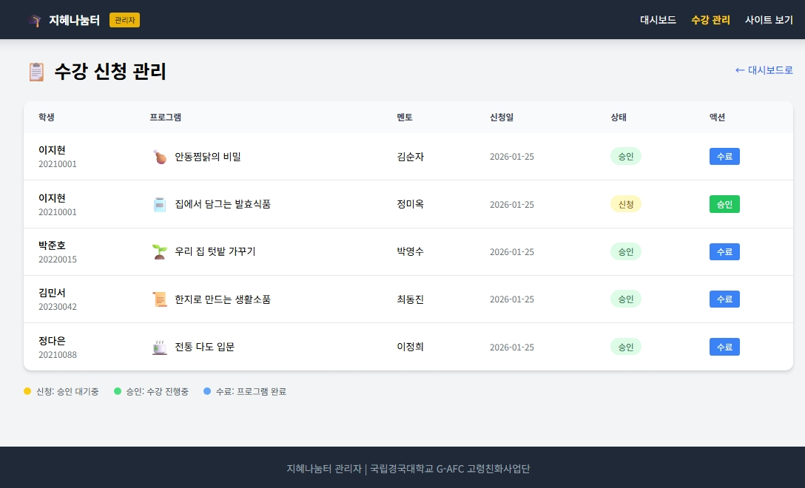

<div align="center">

# 🌟 지혜나눔터 (Jihye Nanumteo)

### 70년의 지혜가 빛나는 순간, 세대를 이어가는 배움의 장

**어르신이 선생님이 되는 세대교류 플랫폼**

[](https://www.python.org/)
[](https://fastapi.tiangolo.com/)
[](LICENSE)

[🎯 프로젝트 소개](#-프로젝트-소개) • [🖼️ MVP 화면](#-mvp-화면-미리보기) • [🚀 시작하기](#-시작하기) • [📊 기술 스택](#-기술-스택) • [🏆 공모전 출품](#-공모전-출품)

</div>

---

## 📖 프로젝트 소개

> "이거 아는 사람이 나밖에 없어. 내가 가면 이 맛도 사라지는 거지."
>  
> 안동 하회마을 어르신의 안동식혜 레시피 전수 이야기에서 시작했습니다.

**지혜나눔터**는 고령자를 '수혜자'가 아닌 '선생님'으로 전환하는 세대교류 프로그램입니다.

### 🎯 해결하고자 하는 문제

- **고령자**: 사회적 역할 상실, 고립감, 경제적 기회 부족
- **청년 세대**: 전통 지식 단절, 피상적인 세대교류
- **지역사회**: 무형문화유산의 소멸 위기

### 💡 핵심 솔루션

| 구분 | 역할 | 기대 효과 |
|------|------|-----------|
| **어르신 멘토** | 지혜와 경험 전수 | 사회적 역할 회복 + 활동비 지급 |
| **대학생 멘티** | 자발적 수강 참여 | 실질적 기술 습득 + 세대 이해 |
| **G-AFC 센터** | 기획/운영/매칭 | 지역사회 연계 + 품질 관리 |

---

## ✨ 핵심 가치

### 🔄 관점의 전환

```text
기존: 어르신 = 돌봄 대상
전환: 어르신 = 지혜를 나누는 선생님
```

### 🏛️ 안동·예천 특화 프로그램

- 🍲 전통 음식: 안동찜닭, 헛제사밥, 간고등어, 안동식혜
- 🎎 예절·다도: 종갓집 예절, 전통 다도
- 🌱 텃밭 농사: 제철 농사법, 발효식품
- 🎨 전통 공예: 한지공예, 매듭, 목공예

### 🎓 참여 방식

- **대학생**: 수강 신청 형태로 자발적 참여
- **어르신**: 멘토로 참여하고 활동비 지급
- **운영기관**: G-AFC 센터가 일정/매칭/품질 관리

---

## 🖼️ MVP 화면 미리보기

### 1) 사용자 화면

| 홈페이지 | 프로그램 목록 |
|---|---|
|  |  |

| 멘토 목록 | 멘토 등록 |
|---|---|
|  |  |

### 2) 관리자 화면

| 관리자 대시보드 | 수강 신청 관리 |
|---|---|
|  |  |

### ✅ 구현 완료 기능

- 홈페이지 랜딩 및 핵심 지표 노출
- 카테고리 기반 프로그램 탐색/상세 조회
- 멘토 조회 및 멘토 등록 신청
- 수강 신청(중복 신청/정원 마감 처리 포함)
- 관리자 대시보드 및 신청 승인/수료 처리

---

## 🚀 시작하기

### Prerequisites

- Python 3.11+
- Git

### Installation

```bash
# 1) 저장소 클론
git clone https://github.com/Lova-clover/Jihye-Nanumteo.git
cd Jihye-Nanumteo

# 2) 가상환경 생성 및 활성화
python -m venv .venv

# Windows
.venv\Scripts\activate

# Mac/Linux
source .venv/bin/activate

# 3) 의존성 설치
pip install -r mvp/requirements.txt
```

### Running the Application

```bash
cd mvp
python main.py
```

브라우저에서 `http://localhost:8000` 접속

---

## 📊 기술 스택

### Backend

- **FastAPI** 0.104.1
- **SQLAlchemy** 2.0.23
- **SQLite**
- **Jinja2**

### Frontend

- **Tailwind CSS**
- **Vanilla JavaScript**

### Design/Docs

- **Python-PPTX** (PPT 자동 생성)
- **Python-DOCX** (제안서 자동 생성)

---

## 📁 프로젝트 구조

```text
Jihye-Nanumteo/
├── mvp/
│   ├── main.py
│   ├── requirements.txt
│   ├── wisdom_sharing.db
│   └── templates/
│       ├── home.html
│       ├── programs/
│       ├── mentors/
│       └── admin/
├── images/
│   ├── homepage.jpeg
│   ├── program.jpeg
│   ├── mentor.jpeg
│   ├── mentor_register.jpeg
│   ├── admin_dashboard.jpeg
│   └── course_registration_management.jpeg
├── 제출한 것/
│   ├── 최종_PPT.pptx
│   ├── 최종_제안서.docx
│   ├── 최종_PPT.pdf
│   ├── 최종_제안서.pdf
│   ├── 고령친화 아이디어_한성주(실버브릿지).pdf
│   ├── 지혜나눔터_MVP_시연.mp4
│   └── G-AFC 고령친화 아이디어 공모전 신청서.*
├── .gitignore
├── LICENSE
└── README.md
```

---

## 🏆 공모전 출품

### G-AFC 고령친화 아이디어 공모전 (2026)

- **출품 부문**: 고령자 대상 프로그램·서비스 아이디어
- **제출일**: 2026년 1월 25일
- **주최**: 국립경국대학교 G-AFC 센터
- **결과**: 미선정

---

## 📝 간단 회고

기획에서 끝내지 않고 실제로 동작하는 MVP를 구현한 점은 분명한 성과였습니다.
다만 공모전 관점에서는 아이디어와 구현 완성도 외에, 다음 요소를 더 강하게 증명했어야 했습니다.

- **실증 데이터**: 인터뷰/파일럿 운영 결과/재참여율 같은 근거
- **실행 설계 밀도**: 리스크 대응, 지속 가능성, 운영 체계 구체화
- **평가 언어**: 무엇을 만들었는지보다 왜 효과가 나는지에 대한 명확한 증명

자세한 회고는 아래 Velog 글에서 확인할 수 있습니다.

- [[회고] 지혜나눔터, 기획·MVP까지 했는데 공모전에서 떨어진 이유 🤔](https://velog.io/@lova-clover/%ED%9A%8C%EA%B3%A0-%EC%A7%80%ED%98%9C%EB%82%98%EB%88%94%ED%84%B0-%EA%B8%B0%ED%9A%8DMVP%EA%B9%8C%EC%A7%80-%ED%96%88%EB%8A%94%EB%8D%B0-%EA%B3%B5%EB%AA%A8%EC%A0%84%EC%97%90%EC%84%9C-%EB%96%A8%EC%96%B4%EC%A7%84-%EC%9D%B4%EC%9C%A0)

---

## 👨‍💻 팀 정보

**팀 실버브릿지 (Team SilverBridge)**

- **대표**: 한성주
- **소속**: 연세대학교 미래캠퍼스

---

## 📄 라이선스

This project is licensed under the MIT License - see the [LICENSE](LICENSE) file for details.

---

<div align="center">

**Made with ❤️ by Team SilverBridge**

*어르신의 지혜가 세대를 잇는 배움이 됩니다.*

</div>
